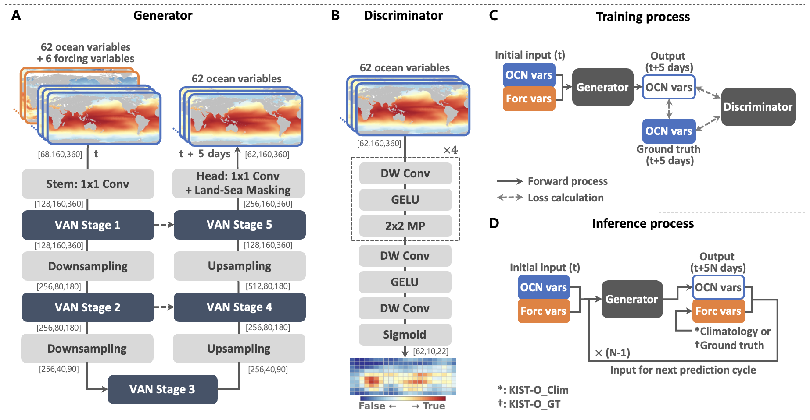

# KIST-Ocean

**A U-shaped visual attention adversarial network for global 3D ocean simulation.**

KIST-Ocean (Korea Institute of Science and Technology – Ocean model) is a data-driven model that simulates the global three-dimensional ocean. It is designed to act as the ocean component of a coupled ocean–atmosphere system, producing only oceanic variables in the same role a dynamical OGCM would play.

This is the model proposed in Kim et al. (2026), *Science Advances* (see [Citation](#citation)).

<p align="center">
  <br>
  <em>Overview of the Korea Institute of Science and Technology’s Ocean model (KIST-Ocean), including its training and inference processes.</em>
</p>

## Overview

- **Inputs:** 62 oceanic variables + 6 surface boundary conditions
- **Outputs:** oceanic variables only — 2 surface variables and 4 three-dimensional variables on 15 vertical levels (5–600 m subsurface)
- **Time step:** 5 days; all input and output fields are 5-day averages
- **Size:** 6.6 million parameters
- **Compute (single NVIDIA A100):** ~33.3 h pretraining + ~2.4 h fine-tuning; a 200-day simulation runs in 6–7 s

## Key design choices

**1. Visual Attention Network (VAN) in a U-shaped backbone.**
VAN is a large-kernel, attention-based convolutional architecture that splits convolution into spatial and channel-wise operations, giving a large receptive field with relatively few parameters. Wrapping it in a U-shaped encoder–decoder adds multi-scale feature extraction and global context: dimensionality is reduced during down-sampling and restored during up-sampling, while skip connections preserve information and fuse local and global features. This keeps the model efficient and stable even with limited training data — enabling a full global 3D ocean model at just 6.6M parameters.

**2. Partial convolution for coastlines.**
Gridded ocean data mix ocean and land at the coast, and standard CNNs share kernels across the grid, which tends to smooth out the strong variability near coastlines. Partial convolution excludes masked (land) cells during convolution, reducing land-induced distortion and better capturing complex coastal variability.

**3. Adversarial training to control rollout drift.**
Autoregressive forecasting (feeding outputs back as inputs) is prone to unrealistic distribution drift over long lead times. KIST-Ocean uses a conditional GAN to keep the output distribution aligned with the ground truth. The discriminator follows the PatchGAN design, scoring many local patches independently rather than emitting a single score for the whole field.

## Training

KIST-Ocean uses a transfer-learning strategy for sufficient data and stable optimization:

- **Pretraining:** CESM2 Large Ensemble long-term simulations, 1850–2014 (2 ensemble members, 23,360 samples)
- **Fine-tuning:** ocean reanalysis, 1982–2013 (2,336 samples)

The generator and discriminator are trained adversarially.

## Inference

At inference, KIST-Ocean runs autoregressively, reusing its outputs as the next inputs. Repeating this 40 times produces simulations up to 200 days ahead.

Because the model does not predict surface boundary conditions, these must be prescribed, giving two simulation modes that bound its capability:

- **KIST-O_GT** — boundary conditions set to ground truth (upper bound)
- **KIST-O_Clim** — boundary conditions set to climatology, the time-invariant input a coupler can supply (lower bound)

For evaluation, both modes were generated for 2014–2023 and compared against persistence and the North American Multi-Model Ensemble (NMME) dynamical seasonal prediction models.

## Repository structure
> <code>KIST-Ocean/</code>: main directory
>> <code>model/</code>
>>> <code>AVAN/</code>
>>>
>>>> <code>train_v01.py</code>: Python script for training KIST-Ocean
>>>> 
>>>> <code>config.py</code>: Configuration for training and inference
>>>> 
>>>> <code>AVAN_v01.py</code>: Python script for the backbone of the KIST-Ocean model
>>>> 
>>>> <code>utils.py</code>: Python script for containing various utility functions
>>>> 
>>>> <code>inferencer_GT.py</code>: Python script for inferring the future ocean state by prescribing ground truth (observation) as the surface boundary condition (i.e., generating KIST-O_GT)
>>>
>>> <code>output/</code>: Directory where the trained model is saved
>>
>> <code>data/</code>: Statistical datasets required for training and inference

## Requirements
- python v3.8.17
- torch v1.13.0
- timm v0.9.16
- netcdf4 v1.6.2
- numpy v1.24.3
- scipy v1.10.1
- matplotlib v3.7.5
- basemap v1.4.1

## Our Linux environment
- OS:CentOS Linux 7
- GPU: Nvidia A100
- CUDA version: 11.7

## Citation

If you use KIST-Ocean in your work, please cite:

> Kim, J. H., Kang, D., Yang, Y. M., Park, J. H., & Ham, Y. G. (2026). Data-driven global ocean model resolving atmospherically forced ocean dynamics. *Science Advances*, 12(24), eaed1225. https://doi.org/10.1126/sciadv.aed1225

```bibtex
@article{kim2026kistocean,
  title   = {Data-driven global ocean model resolving atmospherically forced ocean dynamics},
  author  = {Kim, J. H. and Kang, D. and Yang, Y. M. and Park, J. H. and Ham, Y. G.},
  journal = {Science Advances},
  volume  = {12},
  number  = {24},
  pages   = {eaed1225},
  year    = {2026},
  doi     = {10.1126/sciadv.aed1225}
}
```

## Figures & License

Figures in this repository are from the published article and are licensed
under [CC BY 4.0](https://creativecommons.org/licenses/by/4.0/):

> Kim, J. H., Kang, D., Yang, Y. M., Park, J. H., & Ham, Y. G. (2026).
> Data-driven global ocean model resolving atmospherically forced ocean dynamics.
> *Science Advances*, 12(24), eaed1225. https://doi.org/10.1126/sciadv.aed1225

Note: the CC BY 4.0 license applies to the figures only. Code in this
repository is released under the repository's [LICENSE](./LICENSE).

